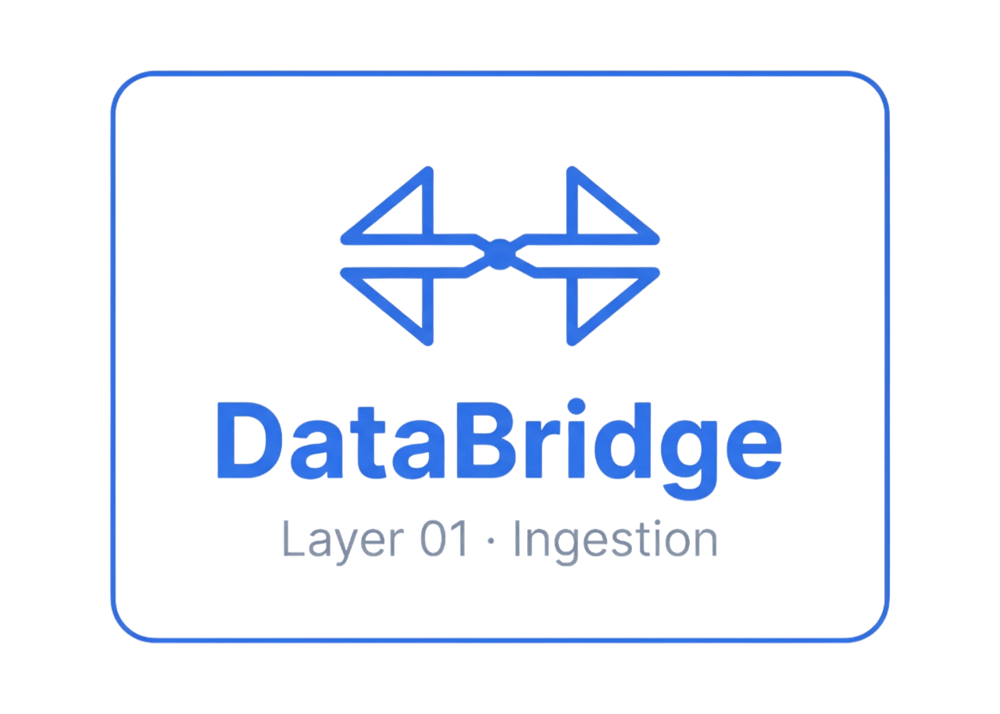
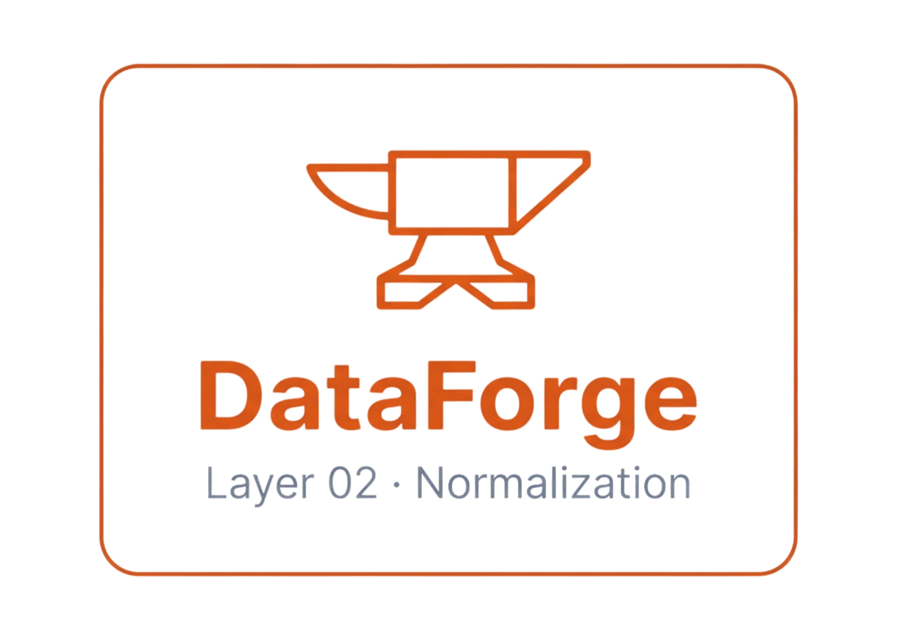
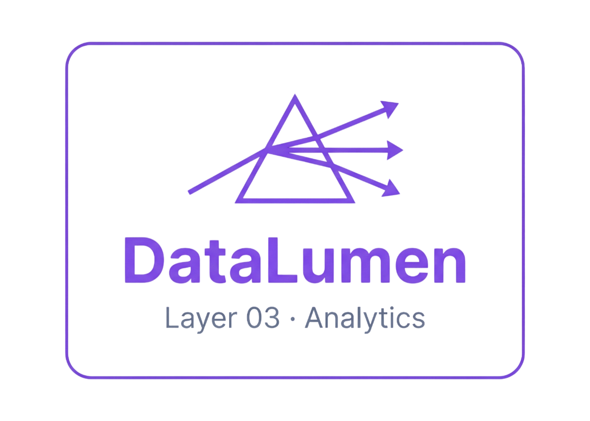
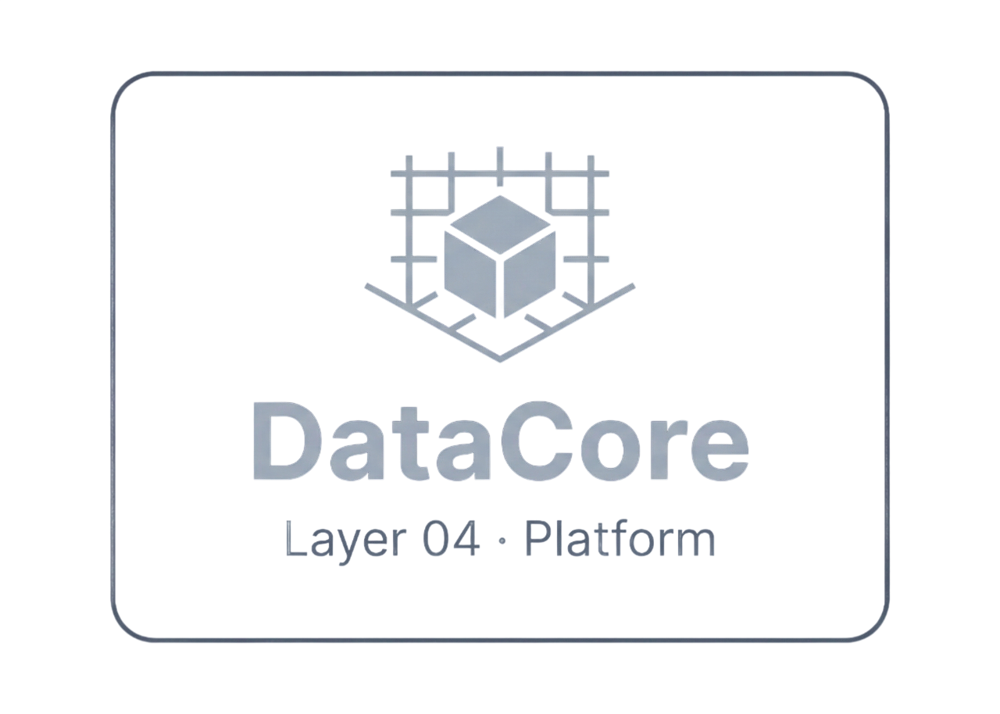

# 🛒 Plataforma de Inteligência de Compras

Uma plataforma SaaS voltada para gestão e análise estratégica do setor de compras de empresas brasileiras.

A ideia é simples: centralizar as notas fiscais da empresa — vindas de ERPs, webhooks ou uploads manuais — e transformar esses dados em dashboards e comparativos que ajudam gestores a tomar decisões melhores na hora de comprar.

---

## O que a plataforma faz?

- 📊 **Dashboards de compras** — visão geral de custos, fornecedores e categorias de produtos
- 💰 **Saving & Cost Avoidance** — registro e acompanhamento de economias realizadas
- 📈 **Benchmark de mercado** — compare sua estrutura de custo com outras empresas (de forma anônima)
- 🔮 **Simulador What-If** — simule cenários e veja o impacto no custo antes de decidir
- 🏭 **Gestão de fornecedores** — histórico, análise de preços e contatos comerciais
- 🔔 **Alertas automáticos** — notificações sobre variações relevantes de preço
- 🔗 **Integrações** — conecta com ERPs (Bling, TinyERP), recebe webhooks e aceita uploads de XML/JSON

---

## As 4 camadas da plataforma

A plataforma é dividida em 4 camadas com responsabilidades bem definidas, cada uma representada por um módulo independente:

---

### Layer 01 · DataBridge — Ingestion


Responsável por **receber os dados** de notas fiscais de diferentes fontes.
Aceita uploads manuais de XML, arquivos JSON, conexão direta com ERPs (Bling, TinyERP) e recebimento via webhooks.
É a porta de entrada de tudo que entra na plataforma.

---

### Layer 02 · DataForge — Normalization


Responsável por **processar e padronizar** os dados recebidos.
Independente de onde vieram, todos os dados passam por aqui para serem transformados num formato único e consistente antes de serem armazenados.

---

### Layer 03 · DataLumen — Analytics


Responsável por **transformar os dados em visão estratégica**.
É a camada que os clientes finais acessam — com dashboards, benchmarks, simuladores e relatórios para apoiar a tomada de decisão no setor de compras.

---

### Layer 04 · DataCore — Platform


Responsável pela **infraestrutura e administração da plataforma**.
Gerencia usuários, empresas, permissões, configurações e toda a base que sustenta os demais módulos.

---

## Estrutura do projeto

O projeto é um monorepo com um backend e quatro aplicações frontend independentes, cada uma voltada para um público diferente:

| Aplicação | Público | Porta |
|---|---|---|
| **DataLumen** | Clientes finais da plataforma | 5173 |
| **DataBridge** | Time interno — integrações e conectores | 5175 |
| **DataCore** | Time interno — administração geral | 5176 |
| **DataForge** | Time interno — operacional | 5177 |

```
├── backend/        → API (PHP + Laravel)
├── DataLumen/      → Frontend clientes
├── DataBridge/     → Frontend integrações
├── DataCore/       → Frontend admin
└── DataForge/      → Frontend operacional
```

---

## Como rodar localmente

### Backend

```bash
cd backend
composer install
cp .env.example .env
php artisan key:generate
php artisan migrate --seed
php artisan serve        # http://localhost:8000
```

### Frontend (exemplo com DataLumen — repita para os demais)

```bash
cd DataLumen
npm install
npm run dev              # http://localhost:5173
```

> As demais aplicações seguem o mesmo processo, cada uma na sua pasta e porta correspondente.

---

## Usuários para teste

| Email | Acesso |
|---|---|
| `admin@primideias.com.br` | Administrador — acesso total |
| `owner@moveis-ruiz.br` | Cliente — acesso ao DataLumen |
| `owner@empresa-x.br` | Cliente — acesso ao DataLumen |

> Senha de todos: `password`

---

## Status do projeto

🟢 Em desenvolvimento ativo — funcionalidades principais implementadas, deploy ainda não configurado.